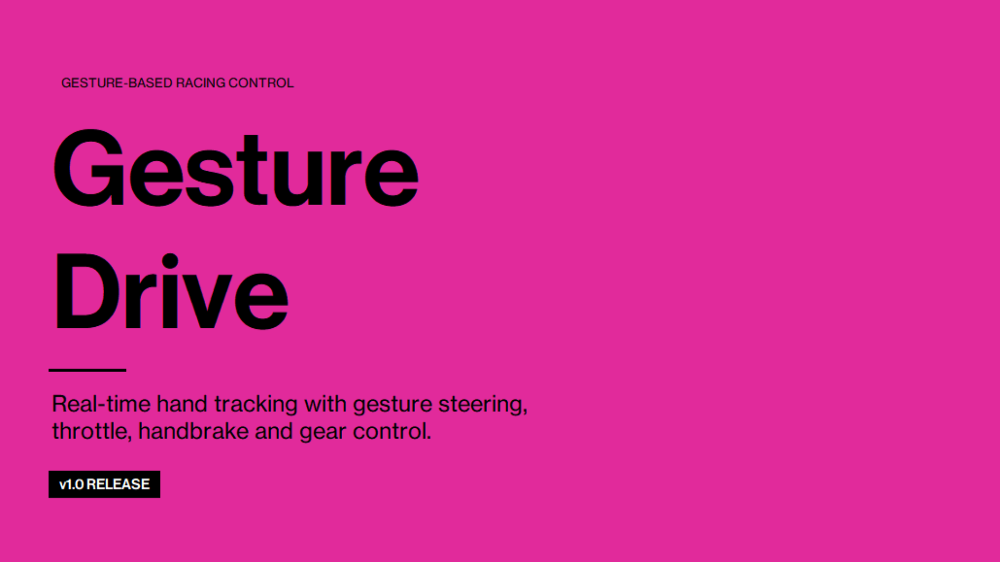
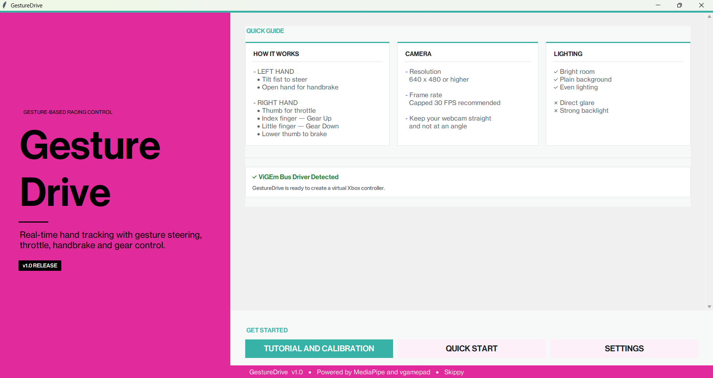
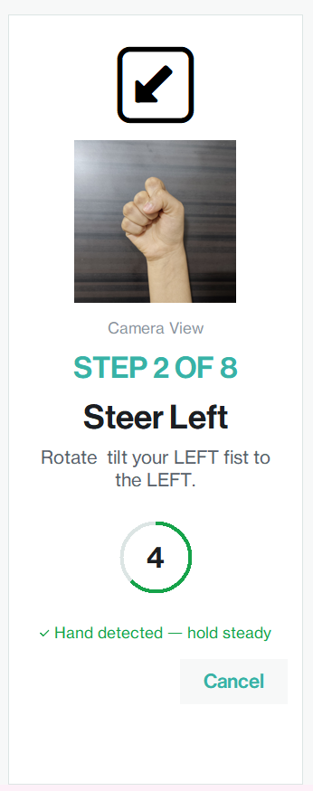
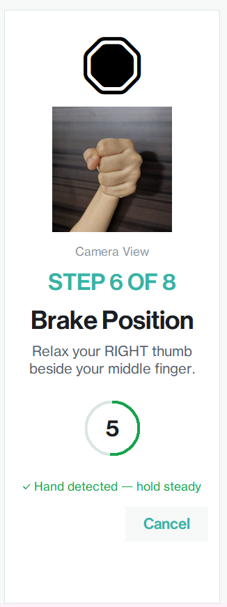
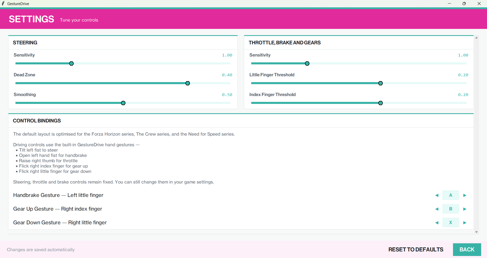
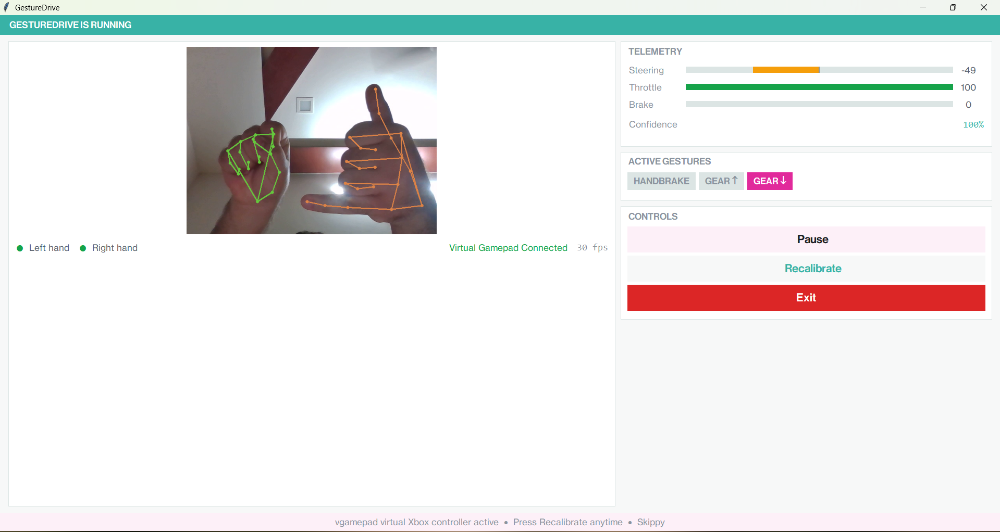

<p align="left">
  
</p>

Control racing games using hand gestures and a standard webcam.

GestureDrive uses MediaPipe hand tracking and a virtual Xbox controller to convert natural hand movements into steering, throttle, braking, handbrake and gear controls.

No gloves. No controllers. Just a webcam.

---

## Features

* Real-time hand tracking using MediaPipe
* Gesture-based steering
* Analog throttle and brake control
* Handbrake gesture
* Gear up and gear down gestures
* Interactive tutorial and calibration wizard
* Virtual Xbox controller emulation
* Customizable control sensitivity
* Modern desktop interface
* Windows executable builds

---

## Screenshots

### Welcome Screen

<p align="center">
  
</p>

### Calibration Wizard

<p align="center">
  
  
</p>

### Settings

<p align="center">
  
</p>

### Runtime

<p align="center">
  
</p>

---

## Controls

| Gesture                   | Action    |
| ------------------------- | --------- |
| Tilt left hand            | Steering  |
| Open left hand            | Handbrake |
| Raise right thumb         | Throttle  |
| Lower right thumb         | Brake     |
| Raise right index finger  | Gear Up   |
| Raise right little finger | Gear Down |

---

## Requirements

* Windows 10 / Windows 11
* Webcam (30 FPS recommended)
* ViGEm Bus Driver

Install ViGEm Bus:

https://github.com/nefarius/ViGEmBus/releases

---

## Installation

### Download Release

1. Download the latest release
2. Install the ViGEm Bus Driver. You may need to RESTART your PC
3. Launch GestureDrive
4. Complete the tutorial and calibration process
5. Start your game

---

## Build Configurations

### Release Build

* pyinstaller GestureDrive.spec

* Creates the end-user version without a console window.

### Development Build

* pyinstaller GestureDrive-dev.spec

* Creates a debug version with a visible console for troubleshooting.

---

## Running From Source

Install dependencies:

```bash
pip install -r requirements.txt
```

Run:

```bash
python main.py
```

---

## Building

Install development dependencies:

```bash
pip install -r requirements-dev.txt
```

Build:

```bash
pyinstaller GestureDrive-dev.spec
```

The executable will be generated in:

```text
dist/GestureDrive/
```

---

## Supported Games

GestureDrive works with games that support XBOX controllers.

Tested with:

* Forza Horizon 4
* Forza Horizon 5
* Need for Speed Unbound

Other than racing games, games accepting XBOX controller as input also work. But may require custom control bindings both in GestureDrive and in-game.

---

## Known Limitations and Bugs

* Webcam quality affects tracking performance
* When accessing laptop camera, it's LED might blink 2-3 times before working. It is just how cameras talk to the app and is not GestureDrive's fault
* Supported only on Windows

* GestureDrive might crash/freeze when opening up the camera. Though it is rare can be fixed by running the app as ADMIN
* Making the app window small might overlap certain text, but doesn't affect its working
* Scrolling also works when it is not necessary on the home screen

---

## Credits

* MediaPipe
* OpenCV
* vgamepad
* ViGEmBus
* Pillow

---

## License

Released under the MIT License.
See the LICENSE file for details.

> **Note**
>
>GestureDrive began as a project done for fun and to gain experience in learning about computer vision, MediaPipe, gesture detection, user interface design, and virtual gamepad emulation using the Python programming language.
>Although it has evolved into a fully functional program, the initial purpose of GestureDrive was purely educational.

